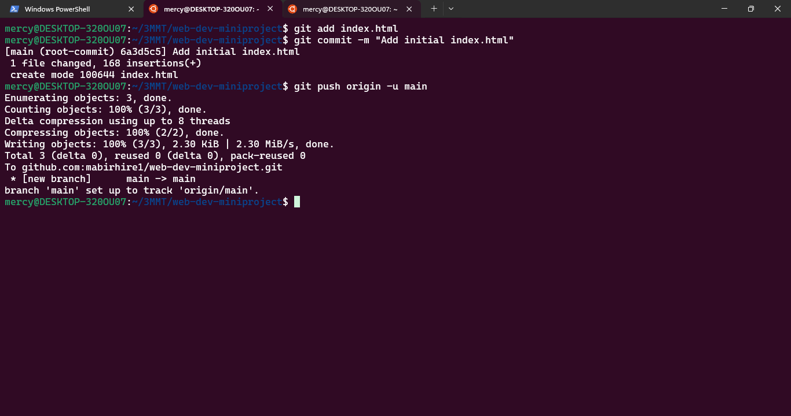
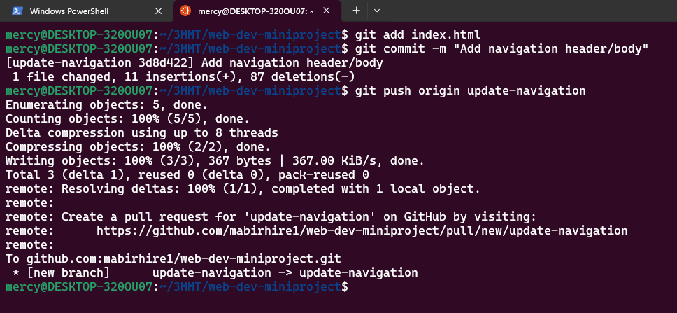
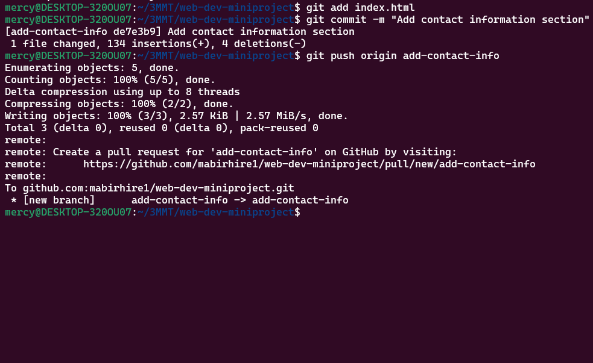
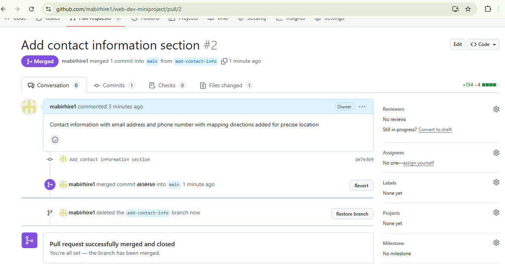
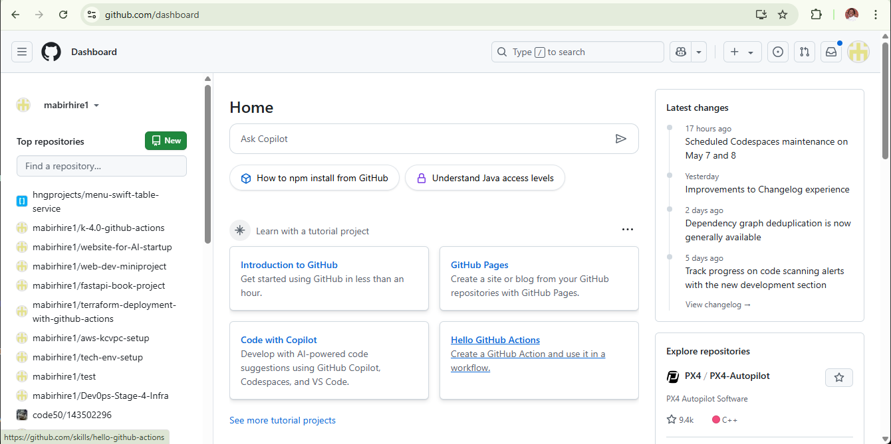

# Git Workflow Assignment Submission

## GitHub Repository
[Link to repository](https://github.com/mabirhire1/web-development-project)

## Required Screenshots

### 1. Repository Cloning

### 2. Initial Commit

### 3. Navigation Branch Creation

### 4. First Pull Request Merge

### 5. Contact Info Branch Creation

### 6. Second Pull Request Merge

### 7. GitHub User Dashboard
